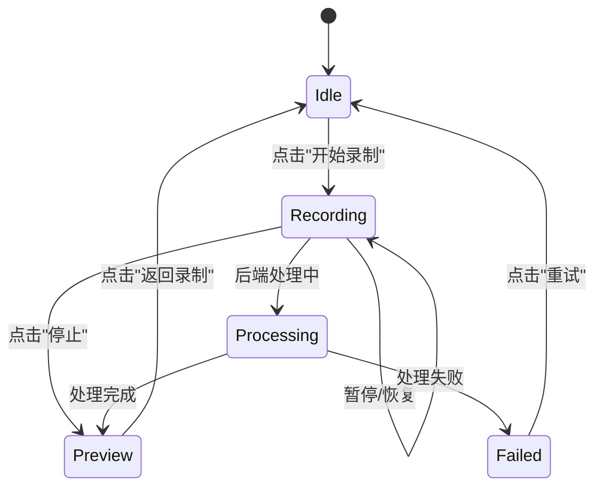

# UI 移植规范与编码准则

> 版本：v1.1
> 日期：2026-05-24
> 依据：`_v0_reference/`、`reference/ui/ui_spec.md`、`docs/architecture/project-architecture-and-overall-planning.md`

## 1. 移植概述

### 1.1 目标

将 `_v0_reference/`（Next.js App Router）中的 UI 设计稿移植到 Tauri 2.0 桌面项目，实现录制前→录制中→预览美化的状态路由。

### 1.2 技术栈

| 技术 | 版本 | 用途 |
|------|------|------|
| React | 19 | UI 框架 |
| TypeScript | 5.x | 类型安全 |
| Tailwind CSS | 4 | 样式系统 |
| shadcn/ui | new-york | 组件库 |
| framer-motion | latest | 动画 |
| lucide-react | latest | 图标 |
| Tauri | 2.0 | 桌面框架 |

### 1.3 核心约束

- **前端只负责展示与交互**，录制状态由 Rust 后端驱动
- **视频帧流和音频流严禁经过前端 JS 层**
- **界面文字必须为中文**

---

## 2. 主题规范（Raycast 风格）

### 2.1 色彩系统

采用 Raycast 近黑中性色主题，所有色彩通过 CSS 自定义属性定义：

```css
/* Canvas — 近纯黑 */
--background: #040506;
--foreground: #ffffff;

/* Card / Surface Level 1 */
--card: #07080a;
--card-foreground: #ffffff;

/* Surface Level 2 */
--popover: #111214;

/* Primary CTA — 近白色 */
--primary: #e6e6e6;
--primary-foreground: #040506;

/* Secondary */
--secondary: #111214;
--secondary-foreground: #e6e6e6;

/* Muted */
--muted: #1b1c1e;
--muted-foreground: #6a6b6c;

/* Accent */
--accent: #1b1c1e;

/* Destructive — Ember Red */
--destructive: #ff6363;

/* Border */
--border: #363739;

/* Custom LuZhi tokens */
--surface: #111214;
--surface-hover: #1b1c1e;
--recording: #ff6363;
```

### 2.2 Tailwind CSS 4 映射

在 `@theme inline` 块中将 CSS 变量映射为 Tailwind 工具类：

```css
@theme inline {
  --color-background: var(--background);
  --color-foreground: var(--foreground);
  --color-card: var(--card);
  --color-primary: var(--primary);
  --color-secondary: var(--secondary);
  --color-muted: var(--muted);
  --color-destructive: var(--destructive);
  --color-border: var(--border);
  --color-surface: var(--surface);
  --color-surface-hover: var(--surface-hover);
  --color-recording: var(--recording);
  /* ... 其他映射 */
}
```

### 2.3 关键注意事项

- **必须在 `<html>` 元素添加 `class="dark"`**，否则主题变量不生效
- 使用 `@custom-variant dark (&:is(.dark *))` 定义 dark 变体
- 字体：Inter (sans)、GeistMono (mono)

---

## 3. 组件架构

### 3.1 文件结构

```
src/
  App.tsx                          -- 五态路由
  App.test.tsx                     -- 组件测试
  styles.css                       -- Raycast 主题
  lib/
    utils.ts                       -- cn() 工具函数
    tauri.ts                       -- Tauri invoke 封装
  components/
    ui/
      button.tsx                   -- shadcn Button
      switch.tsx                   -- shadcn Switch
      slider.tsx                   -- shadcn Slider
      select.tsx                   -- shadcn Select
    recording-panel.tsx            -- 录制配置面板
    recording-status-bar.tsx       -- 录制状态栏
    preview-view.tsx               -- 预览美化视图
    processing-view.tsx            -- 处理中视图
    error-view.tsx                 -- 错误状态视图
```

### 3.2 状态路由



### 3.3 组件职责

| 组件 | 状态 | 职责 |
|------|------|------|
| `RecordingPanel` | idle | 录制配置（模式、音频） |
| `RecordingStatusBar` | recording | 悬浮状态栏（计时、暂停/停止） |
| `PreviewView` | preview | 视频预览、AI 美化、导出 |
| `ProcessingView` | processing | 加载动画 |
| `ErrorView` | failed | 错误提示、重试 |

---

## 4. Tauri 桌面端适配规范

### 4.1 窗口配置

```json
{
  "app": {
    "windows": [
      {
        "title": "录智",
        "width": 800,
        "height": 600,
        "decorations": false,
        "transparent": true
      }
    ]
  }
}
```

### 4.2 拖拽区域

- **每个状态视图的根容器**必须添加 `data-tauri-drag-region`
- **可交互元素**（按钮、输入框等）必须添加 `data-tauri-drag-region={false}` 排除自身
- 否则点击事件会被拖拽逻辑拦截

```tsx
// 正确示例
<div data-tauri-drag-region>
  <div data-tauri-drag-region={false}>
    <Button onClick={handleClick}>点击</Button>
  </div>
</div>
```

### 4.3 透明窗口

- `transparent: true` 配合 `decorations: false` 实现无边框透明窗口
- **前端容器不能使用不透明背景色**（如 `bg-background`），否则覆盖透明效果
- 浮动 UI 组件应只在组件自身设置背景

### 4.4 桌面端行为

```tsx
// 禁用右键菜单和文本选中
useEffect(() => {
  const handler = (e: Event) => e.preventDefault()
  document.addEventListener('contextmenu', handler)
  document.addEventListener('selectstart', handler)
  return () => {
    document.removeEventListener('contextmenu', handler)
    document.removeEventListener('selectstart', handler)
  }
}, [])
```

---

## 5. framer-motion 使用规范

### 5.1 禁止用法

**禁止将 `motion.div` 的 `whileTap` 作为可交互元素的直接父容器**：

```tsx
// ❌ 错误：whileTap 拦截点击事件
<motion.div whileTap={{ scale: 0.99 }}>
  <Button onClick={handleClick}>点击</Button>
</motion.div>

// ✅ 正确：使用 CSS active 伪类
<Button onClick={handleClick} className="active:scale-[0.99]">
  点击
</Button>

// ✅ 正确：将动画直接放在元素上
<motion.button whileTap={{ scale: 0.98 }} onClick={handleClick}>
  点击
</motion.button>
```

### 5.2 推荐用法

- 入场/出场动画：`initial` + `animate` + `exit`
- 悬停效果：`whileHover` 放在元素自身
- 循环动画：`transition.repeat: Infinity`

---

## 6. Tauri 通信接口

### 6.1 类型定义

```typescript
// 录制状态
type RecordingState = 'idle' | 'recording' | 'paused' | 'processing' | 'completed' | 'failed'

// 录制状态载荷
type RecordingStatus = {
  state: RecordingState
  canStart: boolean
}

// 权限状态
type RecordingPermissions = {
  screenRecording: 'granted' | 'denied' | 'notDetermined' | 'unknown'
  microphone: 'granted' | 'denied' | 'notDetermined' | 'unknown'
}

// 录制模式
type CaptureMode = 'fullscreen' | 'window' | 'area'

// 音频配置
type AudioConfig = {
  systemAudio: boolean
  microphone: boolean
}

// 美化配置
type BeautifyConfig = {
  cursorMagnification: boolean
  magnificationFactor: number
  cursorSmoothing: boolean
  autoTrimSilences: boolean
  trimSensitivity: 'low' | 'medium' | 'high'
}

// 导出预设
type ExportPreset = 'bilibili' | 'douyin' | 'xiaohongshu'
```

### 6.2 Tauri Commands

| 函数 | Command | 用途 |
|------|---------|------|
| `fetchRecordingStatus()` | `recording_status` | 获取录制状态 |
| `fetchRecordingPermissions()` | `recording_permissions` | 获取权限状态 |
| `startRecording()` | `start_recording` | 开始录制 |
| `pauseRecording()` | `pause_recording` | 暂停录制 |
| `resumeRecording()` | `resume_recording` | 恢复录制 |
| `stopRecording()` | `stop_recording` | 停止录制 |
| `setCaptureMode(mode)` | `set_capture_mode` | 设置录制模式 |
| `setAudioConfig(config)` | `set_audio_config` | 设置音频配置 |
| `setBeautifyConfig(config)` | `set_beautify_config` | 设置美化配置 |
| `exportVideo(preset)` | `export_video` | 导出视频 |

### 6.3 Tauri Events

| 事件 | 载荷 | 用途 |
|------|------|------|
| `recording-tick` | `{ elapsed: number }` | 录制计时 |
| `mic-level` | `{ level: number }` | 麦克风音量 |
| `recording-state-changed` | `RecordingStatus` | 状态变更 |

---

## 7. 已知问题与预防规则

### BUG-001: 透明窗口背景不生效

**现象**：800x600 不透明背景方框

**根因**：容器使用 `bg-background` 不透明色

**预防**：
- Tauri 透明窗口下，前端容器不能使用不透明背景色
- 浮动 UI 组件只在组件自身设置背景

### BUG-002: 窗口无法拖动

**现象**：idle 状态无法拖动窗口

**根因**：缺少 `data-tauri-drag-region`

**预防**：
- 每个状态视图都需要拖拽区域
- 可交互元素需要 `data-tauri-drag-region={false}` 排除

### BUG-003: 按钮点击无响应

**现象**：点击"开始录制"无反应

**根因**：`motion.div` 的 `whileTap` 拦截点击事件

**预防**：
- 不要用 `motion.div` 包裹可交互元素
- 使用 CSS `active:` 伪类或直接放在元素上

---

## 8. 测试要求

### 8.1 前端测试

- 框架：Vitest + React Testing Library
- Mock：必须 Mock Tauri 的 `invoke` 和 `listen`
- 覆盖率目标：> 60%

### 8.2 Mock 模板

```typescript
const invokeMock = vi.fn()

vi.mock('@tauri-apps/api/core', () => ({
  invoke: (command: string, args?: unknown) => invokeMock(command, args),
}))

vi.mock('@tauri-apps/api/event', () => ({
  listen: vi.fn(() => Promise.resolve(() => {})),
}))
```

### 8.3 framer-motion 测试注意

framer-motion 在 jsdom 中会导致元素重复渲染，使用 `findAllByText` / `getAllByText` 替代 `findByText` / `getByText`。

---

## 9. 编码检查清单

新增或修改 UI 组件时，必须检查：

- [ ] 使用 Raycast 主题色彩（不使用硬编码颜色）
- [ ] 中文界面文字
- [ ] 无 `"use client"` 指令（Vite 项目不需要）
- [ ] 无 `next/image` 或 `next/link` 引用
- [ ] 拖拽区域正确配置
- [ ] 可交互元素排除拖拽
- [ ] `motion.div` 不作为可交互元素的直接父容器
- [ ] Tauri invoke 接口预留（console.log 模拟）
- [ ] 测试覆盖核心交互
